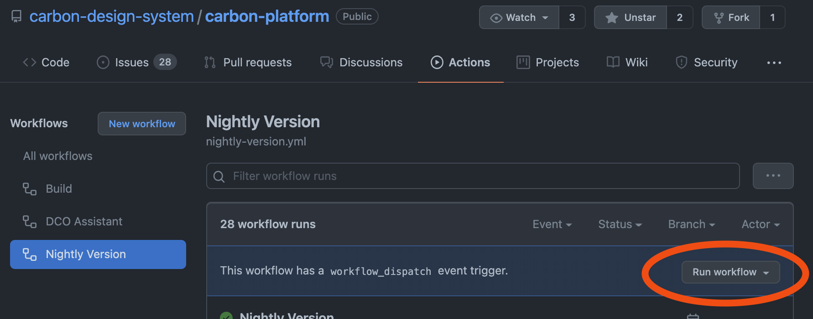

# Nightly builds

There is a GitHub Action/Workflow in place (nightly.yml) that automatically re-builds, re-versions,
and pushes tags for all packages and services that have changed since the previous night. Below are
the details of what happens.

1. Run `micromanage changed`. This will look at each npm workspace in isolation and determine if
   there are any changes to it since its latest tag.
2. Run `micromanage version`. For any workspaces that have changed, each workspace's changelog is
   updated, its `package.json` is updated with a new version number, and a new version tag is
   created and pushed to GitHub.
   - This includes both public and private workspaces.
   - This accounts for services which depend on other packages.
3. Pushed version tags result in the running of one or more `publish-package` and/or
   `publish-service` workflows.
   - For packages, they are built and published to npmjs (when appropriate).
   - For services, a base docker image is built, followed by a service's docker image. This uses the
     Dockerfile in each workspace's directory. Upon successful build, each service is then pushed to
     the IBM Container Registry.

## Daily test environment

Approximately one hour after the nightly workflow runs, a "daily" workflow runs against the
Kubernetes cluster to update the test namespace with all of the latest services created during the
nightly build.

## Manually triggering a nightly build

The Github Action linked to the `nightly.yml` workflow can be manually triggered from the GitHub
user interface.

This is useful under emergency conditions when a rebuild/republish/redeploy of packages and/or
services is needed without waiting for the next nightly build to pick up the current changes on the
main branch.

> Note: Running a manual nightly does not cause a "daily" to run afterward.
